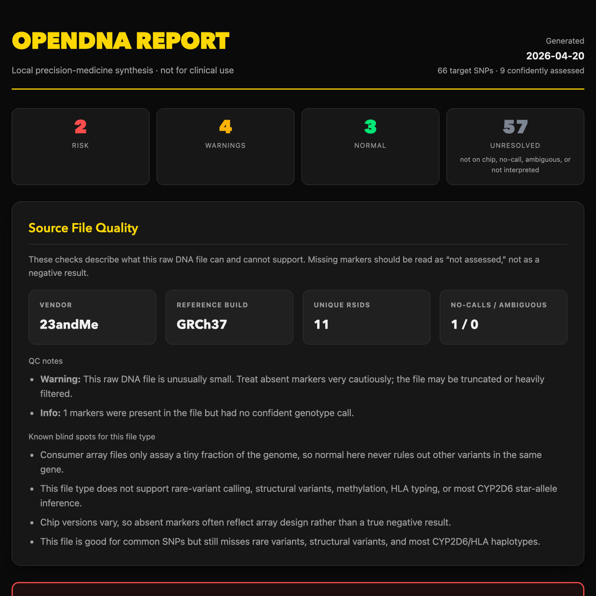

# OpenDNA

> Local-first precision-medicine synthesis for consumer DNA files. Your raw DNA file stays on your machine.

[](https://github.com/corbett3000/OpenDNA/actions/workflows/ci.yml)
[](LICENSE)
[](https://www.python.org/downloads/)

**OpenDNA** parses a 23andMe / AncestryDNA / MyHeritage raw DNA file against 12 curated SNP panels (cardiovascular, methylation, pharmacogenomics, athletic, dietary, HFE, histamine, cognition, stimulant sensitivity, eye health, vitamin D, nicotine), joins findings with ClinVar + PharmGKB/CPIC annotations, and renders a self-contained HTML report. It now also scores match confidence, shows panel coverage / blind spots, and rolls multi-marker patterns like APOE, HFE, MTHFR, alcohol handling, histamine DAO/HNMT, caffeine tolerance, CYP2C19, warfarin PGx, statin PGx, DPYD, AMD susceptibility, vitamin D tendency, and nicotine dependence into composite calls. Optional BYOK LLM synthesis (Anthropic Claude or OpenAI GPT) adds a prose interpretation layer and report Q&A.

**What leaves your machine:** nothing, by default. No account, no upload, no telemetry. The raw DNA file is parsed, analyzed, and rendered entirely offline. If — and only if — you paste an API key and opt in to AI synthesis or report chat, OpenDNA sends filtered report context to the provider you chose: the called findings (panel id + rsid + gene + genotype + tier + short note, plus compact ClinVar / PharmGKB summaries when present), derived report summaries, source-file coverage context, and any question you ask. Your raw DNA file is never transmitted. See the [Privacy](#privacy--what-leaves-your-machine) section for the full rules.

## Sample report

[](https://raw.githack.com/corbett3000/OpenDNA/main/examples/sample-report.html)

**[→ View the live sample report](https://raw.githack.com/corbett3000/OpenDNA/main/examples/sample-report.html)** (renders the actual HTML in your browser)
· [view source](examples/sample-report.html)

The sample was generated from a 23andMe-style raw DNA fixture run through the full OpenDNA pipeline (parse → shipped panels → ClinVar + PharmGKB annotation → rule-based render). No personal raw data is embedded — only the interpreted findings.

---

## ⚠ Not a medical device

OpenDNA is an educational and exploratory tool. **It is not a clinical diagnostic** and its output is not medical advice. Discuss all findings with a qualified clinician before acting on them. Consumer DNA arrays have a meaningful false-positive rate for rare variants — confirmatory testing is required before any clinical decision.

---

## Privacy — what leaves your machine

This is the whole trust claim; read it carefully:

1. **Your raw DNA file never leaves your machine.** Parsing, panel matching, ClinVar + PharmGKB annotation, and the rule-based report all happen on `localhost`. No step in that pipeline touches the network.
2. **LLM synthesis and report chat are opt-in and send a minimal payload.** If and only if you paste an API key and click Generate or ask a report question, OpenDNA sends filtered report context to the provider you chose: called findings (panel id, rsid, gene, genotype, tier, note, and relevant ClinVar / PharmGKB summaries when present), derived report summaries, source-file coverage context, and your question when using report chat. Your raw DNA file is **never** sent.
3. **No telemetry, no accounts, no server-side persistence.** API keys are read from the request, held in memory for one call, then discarded. There is no database.
4. **The server binds to `127.0.0.1` by default.** Only the machine running it can reach it. `--host 0.0.0.0` requires an explicit flag and prints a warning.
5. **Browser-local convenience storage is opt-in and bounded.** The web UI can remember your DNA file path, LLM provider, model, and API key in the browser's `localStorage` (scoped to the exact app origin, such as `http://127.0.0.1:8787`, in that one browser profile). Nothing is written to disk by the server, committed to git, or transmitted anywhere. The **Remember** checkbox controls it; the **Clear saved values** button wipes it instantly.

---

## Prerequisites

- **OS:** macOS, Linux, or Windows (WSL recommended on Windows).
- **Python 3.11 or newer.** Check with `python3 --version`. If you need to install it:
  - macOS (Homebrew): `brew install python@3.13`
  - Ubuntu/Debian: `sudo apt install python3.13 python3.13-venv`
  - Windows: [python.org downloads](https://www.python.org/downloads/)
- **Your raw DNA file** from a consumer testing service (see instructions below).
- *(Optional)* An API key from [Anthropic](https://console.anthropic.com/) or [OpenAI](https://platform.openai.com/api-keys) if you want AI-generated prose interpretation.

### Getting your raw DNA file

| Provider | Path |
|---|---|
| **23andMe** | Account → Settings → Browse raw data → Download raw data. You'll get a `.txt` inside a `.zip`. |
| **AncestryDNA** | Settings → Download raw DNA data → confirm via email → unzip the download. |
| **MyHeritage** | Manage DNA kits → three-dot menu → Download raw DNA data. |
| **FTDNA** | myFTDNA → Data Download → Build 37 Raw Data Concatenated. |

OpenDNA expects a tab-separated file with columns `rsid`, `chromosome`, `position`, `genotype`. All four services above produce this format directly (or inside a zip — just extract the `.txt` first).

---

## Installation

> **Note:** OpenDNA 0.1.0 is pre-PyPI. Install from source for now.

```bash
# 1. Clone the repo
git clone https://github.com/corbett3000/OpenDNA.git
cd OpenDNA

# 2. Create and activate a virtualenv
python3 -m venv .venv
source .venv/bin/activate           # macOS / Linux
# .venv\Scripts\activate            # Windows PowerShell

# 3. Install OpenDNA with all optional LLM providers and dev tools
pip install -e ".[all]"             # core + anthropic + openai SDKs
# -- or --
pip install -e ".[dev,all]"         # adds pytest, ruff, mypy (for contributors)

# 4. Sanity-check
opendna --version
pytest -v                           # (only if you installed [dev])
```

Current contributor baseline: `54` tests passing.

---

## Quickstart — the web UI

```bash
opendna serve
# then open http://localhost:8787 in your browser
```

1. **Paste the absolute path** to your raw DNA file (e.g. `/Users/you/Downloads/genome_yourname.txt`).
2. **Pick panels** — all 12 are selected by default; uncheck to narrow the scope.
3. **(Optional) AI synthesis** — pick Anthropic or OpenAI, pick a model, paste your API key. Leave the provider as *None* for a rule-based report only.
4. **Click *Generate report*.** Watch the progress bar — you'll see the pipeline advance through validate → parse → analyze → annotate → LLM → render.
5. **Ask follow-up questions** in the report-chat box if you want to query a specific gene, pathway, or blind spot.
6. **Download** the self-contained HTML or the structured JSON.

### Default model choices

- **Anthropic:** `claude-sonnet-4-6` (Claude Sonnet 4.6 — fast, good reasoning, prompt caching enabled).
- **OpenAI:** `gpt-4o`.

Override either by typing a different model name into the Model field.

### Remembering your settings

Tick the *Remember* checkbox and OpenDNA will store your DNA file path, LLM provider, model, and API key in your browser's `localStorage` so they re-populate on refresh. Click *Clear saved values* any time to wipe them.

---

## Quickstart — native macOS shell

```bash
./scripts/build_macos_shell.sh --open
```

This builds `build/macos/OpenDNA.app`, discovers this repo checkout (or lets you choose it), launches `opendna serve` from the repo's `.venv`, and embeds the local UI inside a native SwiftUI shell. The shell adds native macOS commands for choosing a DNA file, restarting the local engine, and opening the current session in your browser.

Privacy note: the shell uses a nonpersistent `WKWebView` data store, so the embedded UI does **not** keep `localStorage` values on disk between app launches. The web app's *Remember* checkbox only lasts for the current shell session there.

---

## Quickstart — headless (CLI)

Skip the browser entirely — useful for scripting, agent pipelines, or CI:

```bash
# Scan a file and write <filename>.opendna.html + <filename>.opendna.json next to it
opendna scan ~/Downloads/genome.txt

# Restrict to specific panels
opendna scan ~/Downloads/genome.txt --panels pharmacogenomics methylation

# Check the annotation-database status
opendna update-db
```

The JSON payload is versioned (`schema_version`) and suitable for ingestion by another pipeline stage.

---

## What OpenDNA interprets

Every finding is tier-scored (`risk` / `warning` / `normal` / `unknown`), annotated with match confidence, and, where available, cross-referenced with ClinVar clinical significance and PharmGKB/CPIC dosing guidelines. The report also separates `not on chip`, `no-call`, and `ambiguous` markers so missing data is not misread as a negative result.

| Panel | Focus | Representative genes |
|---|---|---|
| **Cardiovascular & Longevity** | CAD risk, thrombosis, lifespan | APOE, 9p21, FOXO3, LPA, F5, F2, PITX2 |
| **Methylation & Detox** | Folate/B12 cycle | MTHFR, COMT, MTR/MTRR, FUT2, CBS, VDR |
| **Pharmacogenomics (PGx)** | Drug metabolism | CYP2C19, CYP2C9, VKORC1, CYP4F2, SLCO1B1, ABCG2, DPYD, TPMT, CYP3A5 |
| **Athletic Performance & Recovery** | Fiber type, recovery | ACTN3, PPARA, PPARGC1A, COL5A1, IL6 |
| **Dietary Sensitivity** | Lactose, caffeine, alcohol, omega-3 | LCT, CYP1A2, ALDH2, ADH1B, FADS1, TAS2R38 |
| **Eye Health & Macular Degeneration** | Common AMD predisposition | CFH, ARMS2, C3 |
| **Iron Metabolism (HFE)** | Hemochromatosis | C282Y, H63D, S65C |
| **Histamine Handling** | Exploratory histamine breakdown | AOC1 (DAO), HNMT |
| **Nicotine Dependence & Smoking Response** | Smoking heaviness, nicotine reinforcement | CHRNA5, CHRNA3 |
| **Vitamin D & Bone** | Low-25(OH)D tendency, signaling | DHCR7, CYP2R1, GC, VDR |
| **Cognition & Mood** | Plasticity, dopamine | BDNF, DRD2, OXTR |
| **Stimulant Sensitivity** | Caffeine/adenosine | ADORA2A, CYP1A2, COMT, rs2472297 |

The analyzer automatically handles both **allele-order variations** (`AG` == `GA`) and **reverse-strand reports** (panel `CC` matches file `GG` for C/T SNPs), so genotypes from any major consumer-testing vendor should resolve correctly.

### Source-file caveats, now surfaced in the report

- `Not on chip` means the marker was not present in the source file. It does **not** mean the user has a reassuring genotype there.
- `No-call` means the vendor included the marker but did not make a confident genotype call.
- Composite calls are only made where the source file type can support them. OpenDNA still does **not** infer rare variants, structural variants, HLA types, CYP2D6 star alleles, or methylation from array data.
- The histamine panel is exploratory. It can flag lower-clearance DAO/HNMT patterns, but it does **not** diagnose histamine intolerance, food reactions, or mast-cell disease on its own.
- `rs1229984` and `rs2472297` are tendency markers. They can improve alcohol and caffeine context, but they do **not** override actual intake, symptoms, or behavior.
- The AMD, vitamin D, and nicotine panels are predisposition panels. They do **not** diagnose current eye disease, vitamin D deficiency, or addiction by themselves.

---

## Troubleshooting

| Problem | Fix |
|---|---|
| `port already in use` | Run on a different port: `opendna serve --port 9000`. |
| `File not found` in the UI | Use the absolute path (starts with `/` on macOS/Linux, `C:\` on Windows). Drag-and-dropping a file into Terminal also produces an absolute path you can paste. |
| The app hangs on "Calling anthropic…" | The LLM call can legitimately take 10–30 seconds. Give it time. Check that the API key is valid and the model name is spelled correctly. |
| OpenAI: `max_tokens not supported` | Upgrade to latest OpenDNA — we use `max_completion_tokens` now. |
| `ModuleNotFoundError: anthropic` | Install the extra: `pip install -e ".[all]"`. |
| Zip file instead of `.txt` | Unzip first (`unzip genome.zip`), point at the `.txt` inside. |
| Many `unknown` findings | Your file doesn't cover those specific rsids — this is normal. Consumer arrays cover ~700K SNPs out of ~3B possible positions. |
| CI red on Python 3.13 | `uvloop` / `httptools` binary wheels for 3.13 can lag; drop 3.13 from the matrix or rebuild after upstream wheels land. |

---

## Roadmap

- **v0.2** — chat-with-your-genome side pane; PDF export.
- **v0.3** — VCF / whole-genome-sequencing input.
- **v0.4** — polygenic risk scores with population adjustment.

See `docs/superpowers/specs/` for design rationale and `docs/superpowers/plans/` for implementation plans.

---

## Contributing

Bug reports, new panel submissions, and PRs welcome. See [CONTRIBUTING.md](CONTRIBUTING.md) for dev setup and panel-schema guidelines.

---

## Data sources & attribution

- **ClinVar** — NIH, public domain. [ncbi.nlm.nih.gov/clinvar](https://www.ncbi.nlm.nih.gov/clinvar/)
- **PharmGKB / CPIC** — used under [CC BY-SA 4.0](https://creativecommons.org/licenses/by-sa/4.0/). [pharmgkb.org](https://www.pharmgkb.org/) · [cpicpgx.org](https://cpicpgx.org/)
- **SNP interpretation summaries** are the author's own curation, informed by peer-reviewed literature and the sources above.

---

## About the author

Built by **Peter Corbett**.

- X / Twitter: [@corbett3000](https://x.com/corbett3000)
- Bio: [stillrush.co/bio](https://stillrush.co/bio)

Questions, bug reports, and contributions welcome via [GitHub Issues](https://github.com/corbett3000/OpenDNA/issues).

---

## License

Apache License 2.0 — see [LICENSE](LICENSE).
